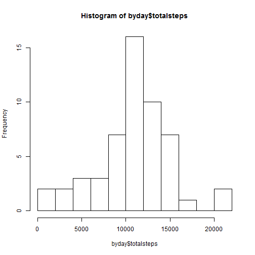
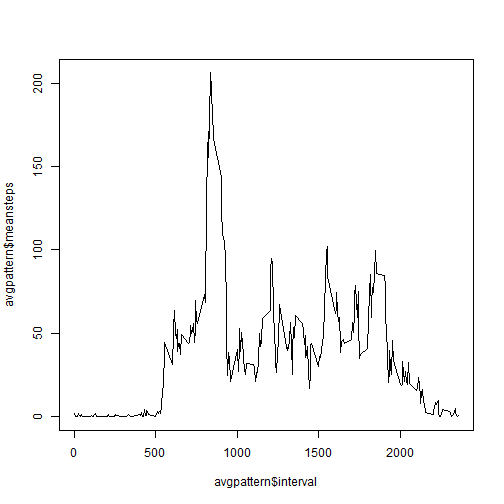
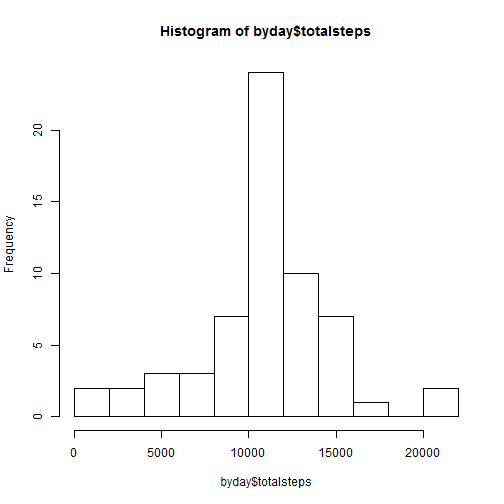
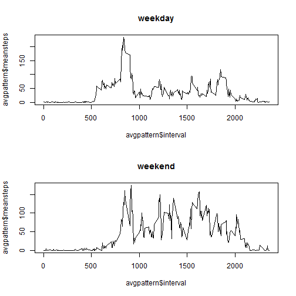

## Loading and preprocessing the data


```r
library(data.table)
library(lubridate)
unzip("activity.zip")
data <- fread("activity.csv")
data$date<-ymd(data$date)
```

## What is mean total number of steps taken per day?


```r
calcandshowbyday <- function(data) {
    byday<- data[, sum(steps), by=date]
    setnames(byday, "V1", "totalsteps")
    hist(byday$totalsteps, breaks=10)
    byday[, .(mean=mean(totalsteps, na.rm=T), median=median(totalsteps, na.rm=T))]
} 
calcandshowbyday(data)
```

 

```
##        mean median
## 1: 10766.19  10765
```


## What is the average daily activity pattern?


```r
plotpattern <- function(avgpattern, title) {
    plot(avgpattern$interval, avgpattern$meansteps, type = "l")
}
avgpattern <- data[, .(meansteps=mean(steps, na.rm=T)), by = interval]
plotpattern(avgpattern)
plot(avgpattern$interval, avgpattern$meansteps, type = "l")
```

 

```r
avgpattern[meansteps==max(avgpattern$meansteps),]
```

```
##    interval meansteps
## 1:      835  206.1698
```


## Imputing missing values


```r
sum(!complete.cases(data))
```

```
## [1] 2304
```

Missing values will be filled with the average value for that interval  
calcandshowbyday function will be used to show histogram, mean and median the same way as without imputation


```r
datawithavg <- merge(data, avgpattern, by="interval")
dataimputed<-datawithavg[, .(
        date
        , interval
        , steps=ifelse(is.na(steps), meansteps, steps)
    )
]
calcandshowbyday(dataimputed)
```

 

```
##        mean   median
## 1: 10766.19 10766.19
```
The histogram has only changed "in the middle", its highest cell became even higher. The mean of days hasn't changed, the median of days became equal to the mean.  
All of these changes are caused by the fact that data for whole days was missing only, and we replaced those days with average data of other days


## Are there differences in activity patterns between weekdays and weekends?


```r
data$week<-data[,as.factor(ifelse(substr(weekdays(date, T), 1, 1) !="S", "weekday", "weekend"))]
par(mfrow=c(2,1))
plotpattern(data[week=="weekday", .(meansteps=mean(steps, na.rm=T)), by = interval])
title ("weekday")
plotpattern(data[week=="weekend", .(meansteps=mean(steps, na.rm=T)), by = interval])
title ("weekend")
```

 

